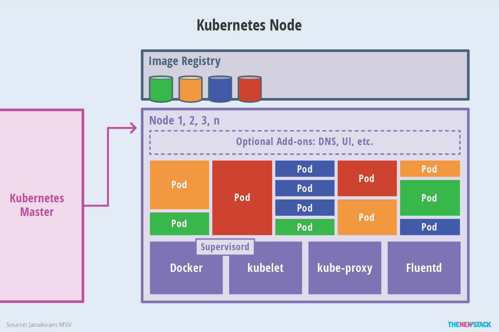

# Cluster Architecture Components

SOURCE: http://thenewstack.io/wp-content/uploads/2016/11/Chart_02_Kubernetes-Architecture.png

Kubernetes cluster gives us more than we bargain for, the question you may ask yourself is how does it offer so much. The answer lies in understanding the architecture. The cluster is simply made of 2 parts which are a Master & Worker node.

# Master

SOURCE: http://thenewstack.io/wp-content/uploads/2016/11/Chart_03_Kubernetes-Master.png

Master node can be seen as the brain of the cluster since it controls and manages worker node(s)' workloads with the help of the following components:
- API Server aka kube-apiserver
  - Gives the user access to the cluster via CLI (kubectl) or UI (k8s dashboard and other UI products)
  - And it acts as the communication bridge between master and worker node
  - Example of how it works, lets say you perform one of the CRUD operations, the following steps is what kube-apiserver follows:
    - Initial point of where the user will input the commands would be via CLI or UI
    - Then kube-apiserver
      - Authenticate User
      - Validate Request (if not valid, stop the process and sends the message back to the user)
      - Updates etcd data based on the command
      - Sends a success/partial success message to the user
    - If needed the Scheduler will
      - Act according to it's monitoring triggers from kube-apiserver based on the information added or changed on the previous step
      - Then sends information to kube-apiserver
    - If kube-apiserver gets a message from a Scheduler
      - It processes information from Scheduler
      - Updates etcd data (scheduling details)
      - Then send information (such as scheduling details) to node's kubelet
    - kubelet
      - Processes information from kube-apiserver like updates that kubelet should make on the node
      - Then send information back to kube-apiserver
    - Then kube-apiserver updates etcd based on kubelet information
  - Configurations

    kube-apiserver has a certain configurations that define how your cluster kube-apiserver is configured, assuming that you have used kubeadm to create your cluster you can inspect those by using the following commands:

    - Get to see the kube-apiserver pod information
      ```
        kubectl get pods -n kube-system
      ```
    - Look at the blueprint
      ```
        cat /etc/kubernetes/manifests/kube-apiserver.yaml
      ```
    - Look at the current options
      ```
        cat /etc/systemd/system/kube-apiserver.service
      ```
    - View the options via a process
      ```
        ps -aux | grep kube-apiserver
      ```
- Scheduler aka kube-scheduler
  - Pods have requirements such as resources and nodes differ in terms of what type of pods they can cater for, that's where kube-scheduler comes in. It decides which pod goes to which node, based on the following conditions:
    - Resources requirements and limits
    - Taints & Tolerations
    - Node Selectors/Affinity
  - How does it gets to do that:
    - It **Filter nodes** that can't cater for the pods requirements
    - **Rank nodes** that has best resources for the pod
    - Schedule pods to the best node
    - Sends the information to kube-apiserver to complete the process of scheduling
  - Configurations

    Assuming that you have used kubeadm to create your cluster you can inspect the configurations by using the following commands:
    - Get to see the kube-scheduler pod information
      ```
        kubectl get pods -n kube-system
      ```
    - Look at the blueprint
      ```
        cat /etc/kubernetes/manifests/kube-scheduler.yaml
      ```
    - View it as a process
      ```
        ps -aux | grep kube-scheduler
      ```
- Controller aka kube-controller-manager
  - kubernetes guarantees us **Self-healing**, **high availability or less downtime** and more, it achieves that by having kube-controller-manager that monitors cluster's state and remediate situation to desired state
  - kube-controller-manager has the following controllers bundled into one process:
    - **Node controller** which monitors nodes
    - **Replication controller** which monitors pods' replicas
    - **Endpoints controller** which monitors endpoints
    - **Service Account & Token controllers** <!-- TODO -->
  - Configurations

    Still assuming that you have used kubeadm to create your cluster you can inspect the configurations by using the following commands:
    - Get to see the kube-controller-manager pod information
      ```
        kubectl get pods -n kube-system
      ```
    - Look at the blueprint
      ```
        cat /etc/kubernetes/manifests/kube-controller-manager.yaml
      ```
    - Look at the current options
      ```
        cat /etc/systemd/system/kube-controller-manager.service
      ```
    - View it as a process
      ```
        ps -aux | grep kube-controller-manager
      ```
- etcd
  - In order for Kubernetes to know what's happening to cluster it records things to etcd so that it can refer to them when needed
  - Configurations
    - Get to see the kube-controller-manager pod information
      ```
        kubectl get pods -n kube-system
      ```
    - View data
      ```
        kubectl exec etcd-master -n kube-system etcdctl get / -- prefix -key-only
      ```

# Worker node

SOURCE: http://thenewstack.io/wp-content/uploads/2016/11/Chart_04_Kubernetes-Node.png

So Master schedules, records data, monitors changes and listen to commands but we haven't heard about how pods plays part, that's where Worker Node comes in. It provides a place for pods to operate. As you have noticed with Master Node, even Worker Node has components that make it possible for the worker node to complete it's duties which is to keep pods running. Those components are as follows:

## kubelet
  - So Master Node did
    - Process the command
    - Scheduled the pod
    - Recorded the data
    - Started motoring changes
  
    But I just want my application to run, who is responsible for that? kubelet is

    kubelet is a captain of the node that makes sure that containers are running in a Pod
  - How does it gets to do that:
    - It register the Pod on the Node
    - Then creates Pods
    - Finally it constantly monitors the Node and its Pods, and reports to kube-apiserver from time to time (for failures and etc)
  - Configurations
    - kubeadm does not automatically install kubelet, you have to manually install it
    - View it as a process
      ```
        ps -aux | grep kubelet
      ```
## kube-proxy
  - Pods get assigned ip address so that you can communicate with it, all thanks to kube-proxy
  - Process
    - Creates an iptable to resolves node pods
  - Configurations
    - Get to see the kube-controller-manager pod information
      ```
        kubectl get pods -n kube-system
      ```
    - View data
      ```
        kubectl get daemonset -n kube-system
      ```
## container runtime
  - Container this, container that. Pods run applications on a container, container runtime is responsible to take care of the container processes.